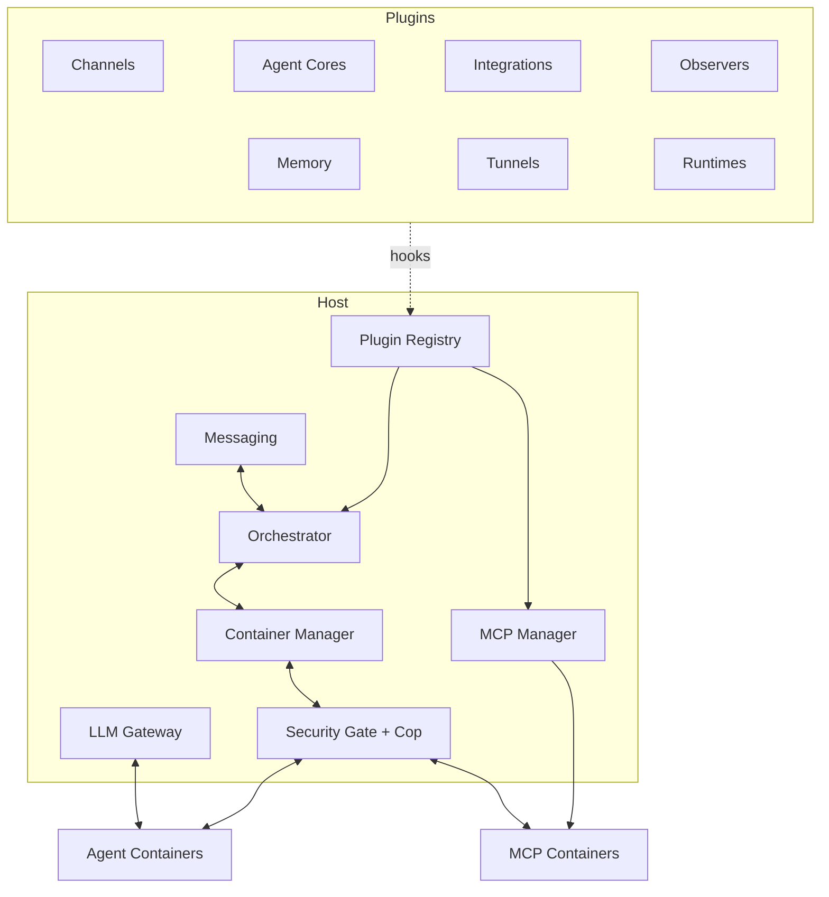

# Architecture

This section explains how Pynchy works under the hood. Understanding these concepts helps you troubleshoot issues, reason about security boundaries, and extend the system through plugins.

## System Overview

## Core Systems

| Topic | What it covers |
|-------|---------------|
| [Container isolation](container-isolation.md) | Mounts, runtime plugins, environment variables |
| [IPC](ipc.md) | File-based communication between containers and host |
| [Message routing](message-routing.md) | Routing behavior, transparent token stream |
| [Message types](message-types.md) | Type system, storage, SDK integration |
| [Git sync](git-sync.md) | Coordinated worktree sync, host-mediated merges |
| [Security](security.md) | Trust model, security boundaries, credential handling |
| [MCP management](mcp-management.md) | McpManager internals, instance deduplication, LiteLLM integration |

## Pluggable Subsystems

These subsystems have dedicated architecture pages explaining their internal design. Each is backed by a pluggy hook and can be extended or replaced via plugins.

| Topic | Hook | What it covers |
|-------|------|---------------|
| [Memory and sessions](memory-and-sessions.md) | `pynchy_memory` | Memory backend contract, session management |
| [Observers](observers.md) | `pynchy_observer` | Event bus, event types, persistence |
| [Tunnels](tunnels.md) | `pynchy_tunnel` | Connectivity detection, startup checks |
| [Workspaces](workspaces.md) | `pynchy_workspace_spec` | Managed workspace definitions, config merging |
| [MCP service tools](mcp-service-tools.md) | `pynchy_service_handler` | Host-side tool handlers, security policy |

For user-facing documentation on pluggable subsystems (channels, memory, agent cores), see [Usage](../usage/index.md). For the full list of plugin hooks, see [Hook Reference](../plugins/hooks.md).
