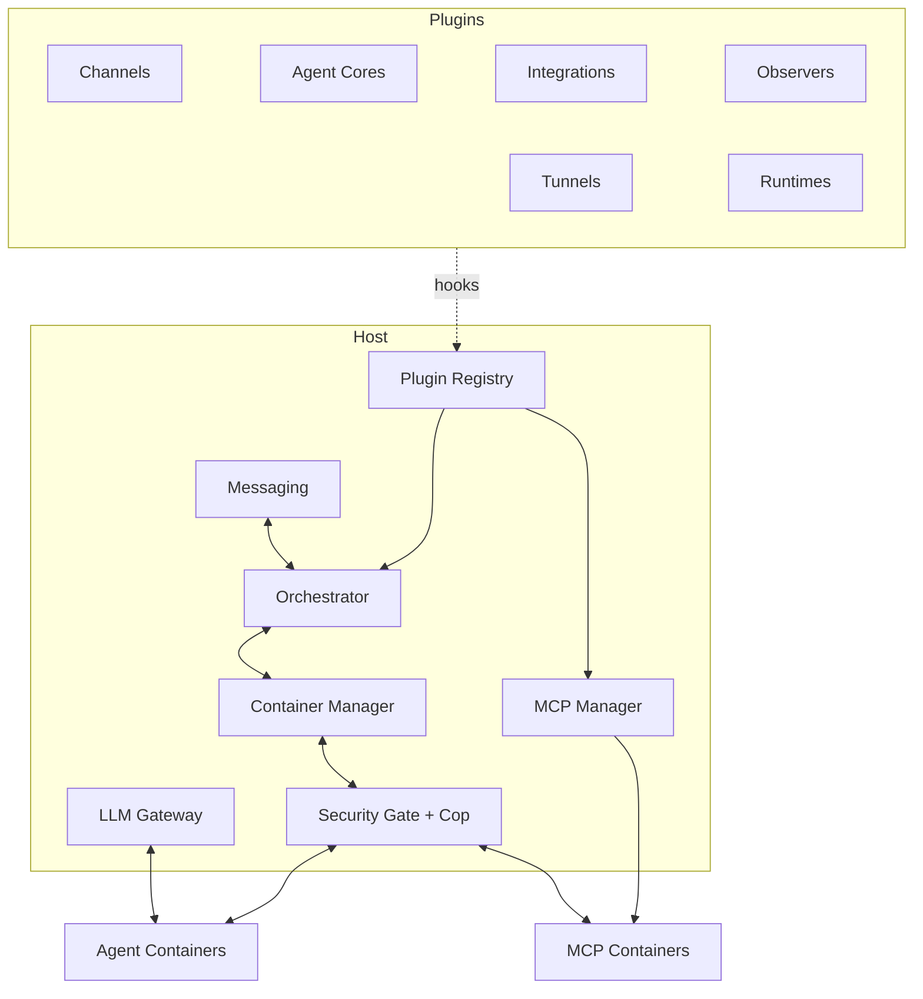

# Architecture

How Pynchy works under the hood. Read this to troubleshoot issues, reason about security boundaries, and extend the system through plugins.

## System Overview

```mermaid
graph TB
    subgraph plugins ["Plugins"]
        CH["Channels"] ~~~ AC["Agent Cores"] ~~~ INT["Integrations"] ~~~ OBS["Observers"]
        TUN["Tunnels"] ~~~ RT["Runtimes"]
    end

    subgraph host ["Host"]
        Registry["Plugin Registry"] ~~~ Messaging
        Orchestrator ~~~ ContainerMgr["Container Manager"]
        MCP["MCP Manager"] ~~~ Security["Security Gate + Cop"]
        Gateway["LLM Gateway"]
    end

    Agent["Agent Containers"]
    MCPCont["MCP Containers"]

    plugins -. "hooks" .-> Registry
    Registry --> Orchestrator
    Registry --> MCP
    Messaging <--> Orchestrator
    Orchestrator <--> ContainerMgr
    ContainerMgr <--> Security
    MCP --> MCPCont
    Security <--> Agent
    Security <--> MCPCont
    Gateway <--> Agent
```

## Core Systems

| Topic | What it covers |
|-------|---------------|
| [Container isolation](container-isolation.md) | Mounts, runtime plugins, environment variables |
| [Configuration layers](configuration.md) | Public defaults, private personalization, secrets, validation, and runtime state |
| [IPC](ipc.md) | File-based communication between containers and host |
| [Message routing](message-routing.md) | Routing behavior, transparent token stream |
| [Routed conversations](conversation-routing.md) | Stable external subjects, FIFO delivery claims, and replaceable Discord controls |
| [Message types](message-types.md) | Type system, storage, SDK integration |
| [Git sync](git-sync.md) | Coordinated worktree sync, host-mediated merges |
| [Security](security.md) | Trust model, security boundaries, credential handling |
| [MCP management](mcp-management.md) | McpManager internals, instance deduplication, LiteLLM integration |
| [Action coverage](action-coverage.md) | Semantic action catalog, hermetic test gate, and real-service canary contract |
| [Memory and sessions](memory-and-sessions.md) | Obsidian memory, automatic learning, automation memory, and session management |

## Pluggable Subsystems

Each subsystem below is backed by a pluggy hook and can be extended or replaced via plugins.

| Topic | Hook | What it covers |
|-------|------|---------------|
| [Observers](observers.md) | `pynchy_observer` | Event bus, event types, persistence |
| [Tunnels](tunnels.md) | `pynchy_tunnel` | Connectivity detection, startup checks |
| [Workspaces](workspaces.md) | `pynchy_workspace_spec` | Managed workspace definitions, config merging |
| [MCP service tools](mcp-service-tools.md) | `pynchy_service_handler` | Host-side tool handlers, security policy |

For user-facing documentation on pluggable subsystems (channels, agent cores,
and host services), see [Usage](../usage/index.md). For the full list of plugin
hooks, see [Hook Reference](../plugins/hooks/index.md).
