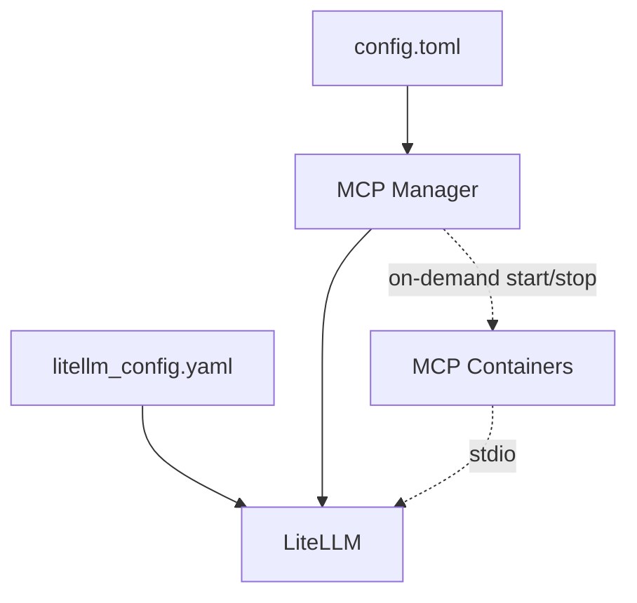

# MCP Management

This page covers the internal architecture of pynchy's MCP server management. For user-facing configuration (adding servers, environment variables, multi-tenant setup), see [MCP Servers](../usage/mcp.md).

## Architecture

## Key concepts

**Instance deduplication.** Workspaces sharing the same (server, kwargs) naturally share one Docker container. Different kwargs produce different instances. Container naming: `pynchy-mcp-{server}-{hash_of_kwargs}`.

**On-demand lifecycle.** Docker MCP containers start when the first agent needs them and stop after `idle_timeout` seconds of inactivity. This keeps resource usage minimal.

**Per-workspace access control.** Each workspace gets a LiteLLM team with a virtual key scoped to its allowed MCP servers. The agent container receives this key and uses it to authenticate with the LiteLLM MCP endpoint.

## Files

| File | Purpose |
|------|---------|
| `src/pynchy/config/mcp.py` | MCP config models (`McpServerConfig`) |
| `src/pynchy/host/container_manager/mcp/` | MCP lifecycle, LiteLLM sync, team provisioning |
| `src/pynchy/host/container_manager/_docker.py` | Shared Docker helpers |
