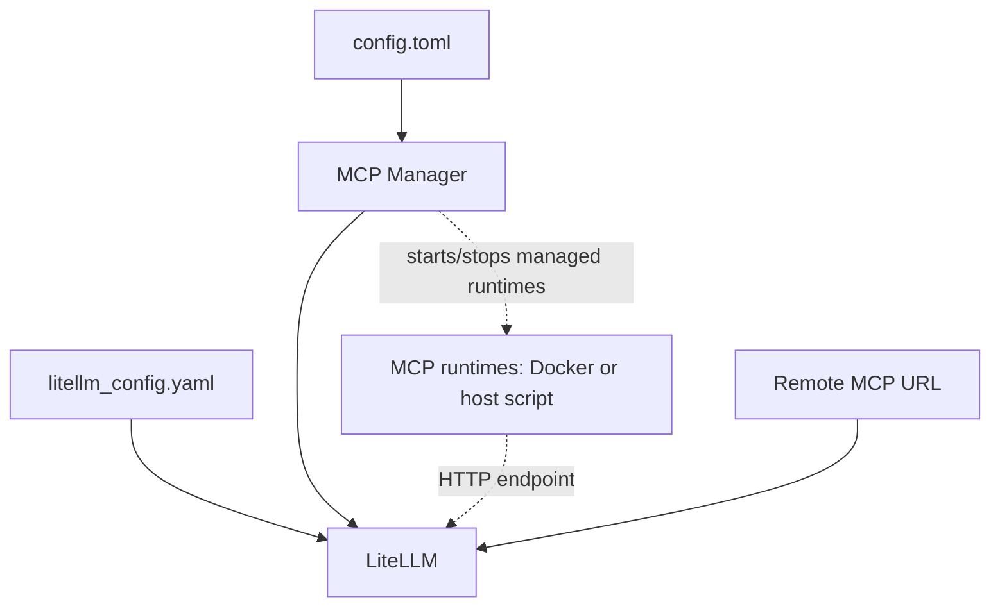

# MCP Management

This page covers the internal architecture of pynchy's MCP server management. For user-facing configuration (adding servers, environment variables, multi-tenant setup), see [MCP Servers](../usage/mcp.md).

## Architecture

```mermaid
graph TB
    Config["config.toml"] --> MCP["MCP Manager"]
    LCFG["litellm_config.yaml"] --> LiteLLM["LiteLLM"]
    MCP --> LiteLLM
    MCP -. "starts/stops managed runtimes" .-> MCPRuntime["MCP runtimes: Docker or host script"]
    MCPRuntime -. "HTTP endpoint" .-> LiteLLM
    Remote["Remote MCP URL"] --> LiteLLM
```

## Key concepts

**Instance deduplication.** Workspaces sharing the same (server, kwargs)
naturally share one managed MCP instance. Different kwargs produce different
instances. Docker instances use names such as
`pynchy-mcp-{server}-{hash_of_kwargs}`.

**On-demand lifecycle.** Docker MCP containers and script MCP subprocesses
start when the first agent needs them and stop after `idle_timeout` seconds of
inactivity. Remote URL servers are already running elsewhere, so Pynchy only
registers their endpoint.

**Per-workspace access control.** Each workspace gets a LiteLLM team with a virtual key scoped to its allowed MCP servers. The agent container receives this key and uses it to authenticate with the LiteLLM MCP endpoint.

## Files

| File | Purpose |
|------|---------|
| `src/pynchy/config/models.py` | User MCP tool configuration (`McpTool` and `McpToolConfig`) |
| `src/pynchy/host/container_manager/mcp/` | MCP lifecycle, LiteLLM sync, team provisioning |
| `src/pynchy/host/container_manager/docker.py` | Shared Docker helpers |
