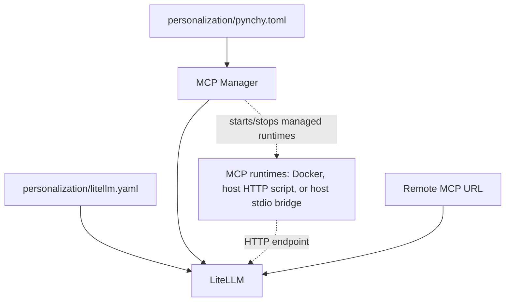

# MCP Management

This page covers the internal architecture of pynchy's MCP server management. For user-facing configuration (adding servers, environment variables, multi-tenant setup), see [MCP Servers](../usage/mcp.md).

## Architecture

```mermaid
graph TB
    Config["personalization/pynchy.toml"] --> MCP["MCP Manager"]
    LCFG["personalization/litellm.yaml"] --> LiteLLM["LiteLLM"]
    MCP --> LiteLLM
    MCP -. "starts/stops managed runtimes" .-> MCPRuntime["MCP runtimes: Docker, host HTTP script, or host stdio bridge"]
    MCPRuntime -. "HTTP endpoint" .-> LiteLLM
    Remote["Remote MCP URL"] --> LiteLLM
```

## Key concepts

**Instance deduplication.** Workspaces sharing the same (server, kwargs)
naturally share one managed MCP instance. Different kwargs produce different
instances. Docker instances use names such as
`pynchy-mcp-{server}-{hash_of_kwargs}`.

**On-demand lifecycle.** Docker MCP containers and host MCP subprocesses
start when the first agent needs them and stop after `idle_timeout` seconds of
inactivity. Remote URL servers already run elsewhere, so Pynchy only
registers their endpoint. Pynchy records marker-verified ownership of each host
subprocess group before readiness checks begin. Startup reaps only groups whose
saved PID still carries that marker, preventing a service crash from leaking
MCP subprocesses without risking an unrelated process that reused the PID.

## Host stdio servers

`runtime = "stdio"` starts a Pynchy-managed loopback Streamable HTTP bridge.
The bridge connects to the configured MCP command over standard input and
output. The existing MCP proxy remains between agent containers and the
bridge, so security gating, capability policy, approvals, and response
fencing stay on the normal path.

The bridge passes through only `HOME`, `PATH`, temporary-directory, and locale
variables. Static non-secret `mcp.env` values and the selected tool's
`required_env` and `optional_env` declarations supplement that baseline. This
avoids exposing the Pynchy service environment to a host stdio command.

Docker MCP commands receive value-free `-e NAME` flags. Pynchy supplies the
values only in the Docker CLI subprocess environment, not in argv. Script
runtimes use the same filtered process baseline. For the user-facing
authorization model, see [Tool access and secrets](../usage/tool-access.md).

**Per-workspace access control.** Each workspace gets a LiteLLM team with a
virtual key scoped to its available MCP servers. A missing required environment
variable removes only that tool before team provisioning. The agent container
receives the key and uses it to authenticate with the LiteLLM MCP endpoint.

## Files

| File | Purpose |
|------|---------|
| `src/pynchy/config/models.py` | User MCP tool configuration (`McpTool` and `McpToolConfig`) |
| `src/pynchy/host/container_manager/mcp/` | MCP lifecycle, LiteLLM sync, team provisioning |
| `src/pynchy/host/container_manager/mcp/stdio_bridge.py` | Loopback Streamable HTTP bridge for host stdio servers |
| `src/pynchy/host/container_manager/docker.py` | Shared Docker helpers |
