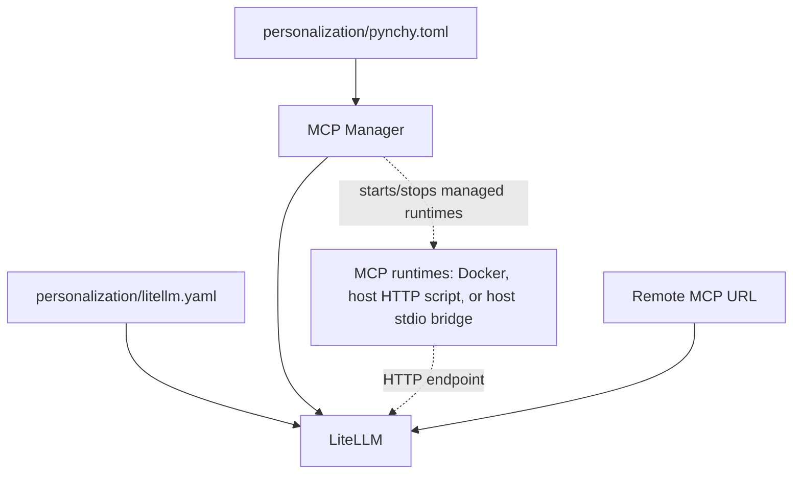

# MCP Management

This page covers the internal architecture of pynchy's MCP server management. For user-facing configuration (adding servers, environment variables, multi-tenant setup), see [MCP Servers](../usage/mcp.md).

## Architecture

```mermaid
graph TB
    Config["personalization/pynchy.toml"] --> MCP["MCP Manager"]
    LCFG["personalization/litellm.yaml"] --> LiteLLM["LiteLLM"]
    MCP --> LiteLLM
    MCP -. "starts/stops managed runtimes" .-> MCPRuntime["MCP runtimes: Docker, host HTTP script, or host stdio bridge"]
    MCPRuntime -. "HTTP endpoint" .-> LiteLLM
    Remote["Remote MCP URL"] --> LiteLLM
```

## Key concepts

**Instance deduplication.** Workspaces sharing the same (server, kwargs)
naturally share one managed MCP instance. Different kwargs produce different
instances. Docker instances use names such as
`pynchy-mcp-{server}-{hash_of_kwargs}`.

**On-demand lifecycle.** Docker MCP containers and host MCP subprocesses
start when the first agent needs them and stop after `idle_timeout` seconds of
inactivity. Remote URL servers already run elsewhere, so Pynchy only
registers their endpoint.

## Host stdio servers

`runtime = "stdio"` starts a Pynchy-managed loopback Streamable HTTP bridge.
The bridge connects to the configured MCP command over standard input and
output. The existing MCP proxy remains between agent containers and the
bridge, so security gating, capability policy, approvals, and response
fencing stay on the normal path.

The bridge passes through only `HOME`, `PATH`, temporary-directory, and locale
variables. Static `env` values and explicit `env_forward` mappings supplement
that allowlist. This avoids exposing the Pynchy service environment to a host
stdio command.

**Per-workspace access control.** Each workspace gets a LiteLLM team with a virtual key scoped to its allowed MCP servers. The agent container receives this key and uses it to authenticate with the LiteLLM MCP endpoint.

## Files

| File | Purpose |
|------|---------|
| `src/pynchy/config/models.py` | User MCP tool configuration (`McpTool` and `McpToolConfig`) |
| `src/pynchy/host/container_manager/mcp/` | MCP lifecycle, LiteLLM sync, team provisioning |
| `src/pynchy/host/container_manager/mcp/stdio_bridge.py` | Loopback Streamable HTTP bridge for host stdio servers |
| `src/pynchy/host/container_manager/docker.py` | Shared Docker helpers |
