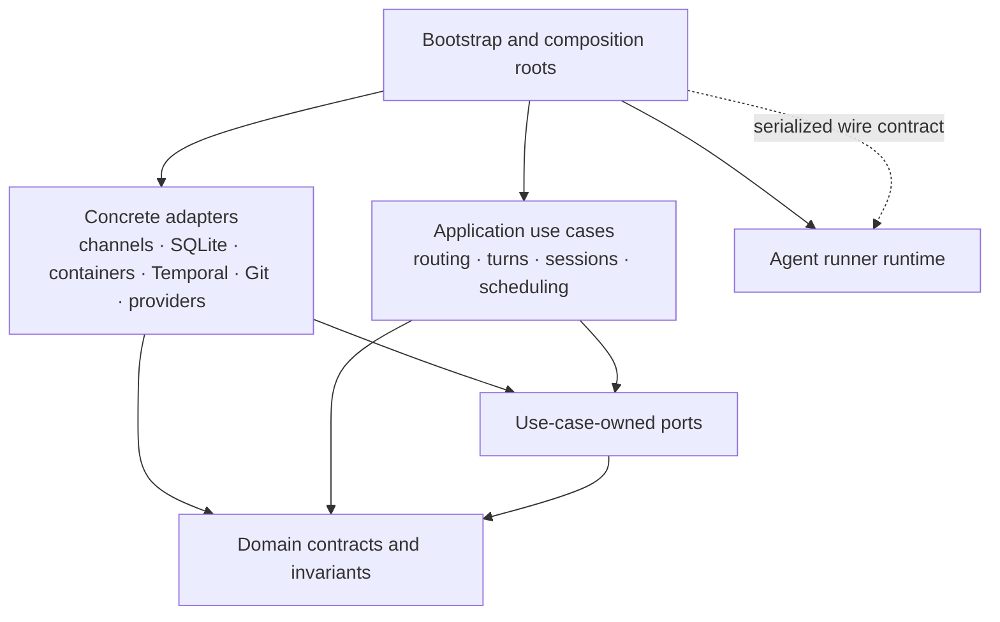

# Service Boundary Roadmap

Use this roadmap to make Pynchy's modular monolith easier to change safely. It
defines the target dependency direction, the architectural debt found during
the boundary audit, and the enforcement work that prevents agents and
maintainers from adding surprising cross-subsystem connections.

## Directive

Build a deterministic, ratcheted architecture-boundary checker, then use it to
guide small refactoring slices. Do not start with a repository-wide file move.
Each slice must introduce or narrow a typed contract, move one dependency
behind that contract, and shrink the recorded boundary debt.

Keep Pynchy as a modular monolith. A service boundary in this roadmap means:

- one package owns the use case and its invariants;
- data crosses the boundary through a semantic type;
- the consuming use case owns the port it needs;
- a concrete adapter implements that port;
- only a composition root selects and wires concrete implementations; and
- persistence operations preserve the transaction that gives the use case its
  meaning.

This work does not call for network services, a generic dependency-injection
framework, or a framework-driven rewrite.

## Preserve the parts that already work

The audit found a coherent runtime path beneath the porous package graph:

- channel input converges on the messaging pipeline;
- one stable runtime and queue own each routed conversation;
- in-flight turns provide durable recovery checkpoints;
- routed conversations use provider-neutral identities and FIFO delivery
  claims; and
- `complete_in_flight_turn()` already commits the turn, routing cursor, and
  optional delivery claim in one SQLite transaction.

Refactoring must preserve those invariants. In particular, do not replace
use-case-shaped state operations with generic CRUD repositories, and do not
split atomic completion across multiple adapter calls.

## Architectural findings

The import counts below describe a source-level AST snapshot at commit
`9a2f2c67`. They include runtime and `TYPE_CHECKING` imports. Counts provide
reproducible evidence, not targets for a degree-based lint rule.

### Package ownership does not match runtime ownership

Several major subsystems import each other in both directions:

| Boundary | Imports in one direction | Imports in reverse | Representative reverse dependency |
|---|---:|---:|---|
| Orchestrator and container manager | 37 | 10 | IPC handlers import orchestrator workspace and deploy behavior |
| Orchestrator and Temporal | 13 | 18 | Temporal activities import orchestrator execution and scheduling implementations |
| Messaging and container manager | 10 | 2 | IPC question handlers import messaging-owned pending-question state |
| Orchestrator and plugins | 27 | 6 | Linear and Matrix implementations import orchestrator workspace behavior |

Some orchestrator-to-adapter imports belong in composition roots. The reverse
imports do not. They let adapters call concrete sibling implementations and
make package cycles part of ordinary feature work.

The `plugins` package also mixes two architectural roles. Its hookspecs and
contracts form an inward-facing extension API, while its channel, integration,
observer, runtime, and agent-core implementations form outward-facing
adapters. A boundary policy must distinguish those roles instead of allowing
or rejecting all `pynchy.plugins` imports together.

The top-level `pynchy` package has the same classification problem. It contains
domain-like contracts alongside operational canaries and security exercises
that import state, plugins, Git, and container security. Define components by
explicit path patterns, not only by the first package segment or directory
depth.

Concrete plugin implementations currently reach through multiple layers:

- 16 plugin imports target `pynchy.state`;
- 10 target the container manager;
- 6 target orchestrator implementations; and
- 2 target Temporal implementations.

Examples include Linear work-item code importing Temporal schedule helpers,
Discord approval code importing container security approval, and Matrix
connection code importing orchestrator conversation control. These imports
make a plugin an implicit application service instead of an adapter.

### Core configuration knows concrete plugins

`pynchy.config.models` says plugin-specific configuration belongs to plugins,
but it imports the Linear tool and Matrix connection models to build core
discriminated unions. That dependency points from core configuration toward
concrete integrations.

Introduce a plugin-owned configuration registration contract. Core
configuration should parse core settings and registered plugin blocks without
importing specific integration modules.

### Infrastructure reads ambient application configuration

`pynchy.state.connection.init_database()` calls `get_settings()` to discover
the database path. This makes the SQLite adapter depend on ambient global
configuration and gives tests a second initialization path.

Pass the database path or a narrow state-runtime configuration value from the
composition root. Apply the same rule when touching other adapters: receive
resolved values during construction or startup rather than reading global
settings deep inside an operation.

### Security and routing semantics travel through metadata strings

The messaging pipeline reconstructs a turn identifier, external trust
provenance, and conversation claim from `NewMessage.metadata` keys such as:

- `turn_id`;
- `authenticated_external_route`;
- `public_source_input`;
- `external_provider`; and
- `conversation_claim_id`.

These values affect taint, ownership, idempotency, and transactional
completion. A mutable `dict[str, Any]` does not prove that a provider
authenticated them or that all required fields travel together.

Introduce an `InboundEnvelope` containing the user-facing message plus typed
turn, source-provenance, and delivery identities. Keep metadata for optional
transport or presentation details such as attachments and reply rendering;
do not use it as the authority for security or lifecycle decisions.

### Dependency protocols can become service locators

Focused protocols already exist, but several expose a large share of the live
application. `MessageHandlerDeps` includes workspace registries, queue state,
session controls, deployment, channel delivery, agent execution, output
handling, and event emission. `SchedulerDependencies` has a similarly broad
surface, and `make_scheduler_deps()` currently casts the whole `PynchyApp` to
that protocol.

Split these contracts by use case. Prefer capabilities such as
`TurnExecutor`, `TurnCheckpointStore`, `DeliveryPublisher`, and
`SessionResetter` over a facade that happens to match `PynchyApp`. Keep
`PynchyApp` as the lifecycle owner and composition root, not a value that
application code passes through as a general service locator.

### The agent event stream has documentation but no protocol enforcement

`AgentEvent` contains an unchecked `type: str` and `data: dict[str, Any]`.
`AgentCore.query()` documents a required result event, but the container and
host-direct consumers do not enforce:

- exactly one terminal result;
- no events after the terminal result;
- a valid payload for each event kind;
- a failure on an unknown event kind; or
- a typed outcome when a stream ends without a result.

The provider cores compensate differently. A reproduced Codex failure shows
the correctness risk: query setup resets pending error state but leaves the
previous agent message and turn metadata intact. A clean later turn without a
new result can therefore synthesize the preceding turn's answer and usage as a
new success.

Replace `AgentEvent` with a discriminated event union and put one stream
validator in front of both consumers. The validator must hold the first result
until end-of-stream, reject duplicates and post-result events, turn a clean
result-less EOF into a typed terminal error, preserve cancellation as a
distinct outcome, and require every provider to reset all per-turn state.

Do not wait for the package-boundary migration before fixing this defect. It
has independent correctness impact and can land as an early slice.

### Foundational types carry broad coupling

`WorkspaceProfile`, `NewMessage`, `Channel`, and `Settings` remain highly
connected even after removing Graphify's misleading inferred import-fanout
edges. Some centrality makes sense: stable domain contracts should have many
consumers.

`pynchy.types` also combines several architectural roles: domain identities,
workspace and security configuration, host-to-runner wire models, outbound
presentation events, and the channel adapter protocol. The `Channel` protocol
even reaches into the orchestrator formatter package for a type annotation.
Split this module by ownership as contracts stabilize, while preserving
intentional public re-exports during migration.

Do not add a hook that limits import degree or bans these names. Instead:

- split a type when it combines unrelated reasons to change;
- keep identity and lifecycle types independent from adapter behavior;
- move presentation-only fields away from security-critical fields; and
- depend on the narrowest semantic contract required by a use case.

Centrality should prompt review, not produce an automatic violation.

### Existing enforcement stops at different boundaries

`check_private_test_imports.py` prevents tests from coupling to private
first-party implementation details and already demonstrates a useful
location-independent ratchet. It does not constrain production package
imports.

`prek.toml` also does not contain an application architecture rule. The
required GitHub test workflow runs pytest but does not run the blocking `prek`
architecture checks. `CODEOWNERS` protects `src/`, but it does not specifically
protect the architecture policy, its checker, `prek.toml`, or the CI workflow.

## Target dependency direction

Use this dependency direction:



The corresponding package roles follow:

| Role | Intended contents | Dependency rule |
|---|---|---|
| Domain contracts | Conversation identity, turn identity, provenance, delivery identity, lifecycle outcomes | Depend on the standard library and other domain contracts only |
| Application use cases | Inbound admission, turn execution, session control, scheduling policy, finalization | Depend on domain contracts and owned ports |
| Ports | Narrow protocols named for application capabilities | Depend on domain contracts, never concrete adapters |
| Plugin API | Hookspecs, registration contracts, plugin-neutral descriptors | Follow the same inward-facing rules as ports |
| Concrete adapters | Channels, integrations, SQLite, container execution, Temporal, Git, agent providers | Implement ports; do not import sibling adapter implementations |
| Composition roots | CLI bootstrap, app lifecycle, dependency factories | May import and wire concrete implementations |
| Agent runner | Container-side execution and provider normalization | Remain a separate runtime capsule connected through serialized input and output contracts |

Define package roles before deciding whether to move directories. Existing
packages may satisfy a target role during migration. For example,
`pynchy.conversation` already contains useful domain contracts, and
`pynchy.state` already owns several semantic transactions.

## Target data flow

Route one interactive turn through these boundaries:

1. A provider adapter authenticates and parses its payload into an
   `InboundEnvelope`.
2. An application use case admits or claims the envelope and produces a typed
   turn request.
3. An execution port sends that request to the selected host or container
   adapter.
4. A shared validator normalizes the provider stream into valid agent events
   and one terminal result.
5. The application finalizes the turn, cursor, and optional routed-delivery
   claim through one semantic persistence operation.
6. The application emits an `OutboundIntent`; a selected channel adapter
   performs and records the remote delivery.

Adapters may convert wire or SDK shapes at steps 1, 3, and 6. They must not
reconstruct application identity from metadata or call another concrete
adapter to skip a use case.

## Hook implementation program

### 1. Add the blocking package-boundary checker

Create:

- `architecture.toml` for component definitions, allowed dependency edges, and
  named composition roots;
- `architecture-baseline.toml` for existing violations;
- `scripts/prek_hooks/check_architecture_boundaries.py`;
- `tests/test_check_architecture_boundaries.py`; and
- a `check-architecture-boundaries` entry in `prek.toml`.

The checker must:

- parse the entire first-party tree on every run with `pass_filenames = false`;
- resolve absolute and relative imports;
- inspect runtime imports, imports under `TYPE_CHECKING`, and literal dynamic
  imports;
- treat the nested `agent_runner` project as a separate first-party runtime and
  reject direct Python import coupling between it and the host;
- classify plugin contracts separately from plugin implementations;
- enforce a positive allowed-dependency graph;
- allow concrete implementation imports only from named composition roots;
- detect component cycles after applying the policy;
- produce deterministic diagnostics containing the importer, imported module,
  violated rule, and suggested contract direction; and
- complete quickly enough to run on every commit.

Reuse the private-test checker's ratchet concept, not its test-specific
semantics. Record an existing violation by stable importer, target component,
violation kind, occurrence count, and reason. Do not key debt to line numbers.
Fail when:

- a new or changed violation appears;
- a baseline count grows;
- a baseline entry lacks a reason; or
- a baseline entry no longer matches source and should be removed.

The baseline may preserve current debt temporarily. It must never authorize a
new dependency with the same broad package pair merely because another
violation already exists.

### 2. Add narrow bypass checks after typed cutovers

Keep these checks separate from the package graph so each diagnostic names a
specific semantic escape hatch:

- forbid `get_settings()` in domain, application, and state-adapter modules
  after their configuration values become injected;
- forbid reads or writes of security- and lifecycle-critical
  `NewMessage.metadata` keys outside the temporary envelope codec;
- forbid raw `AgentEvent(type="...")` construction outside provider adapters
  and the shared event module after the discriminated union lands; and
- forbid event-type string dispatch outside the shared stream validator and
  explicit presentation mapping.

Activate each rule only after its typed replacement exists. Until then, track
the migration with an exact baseline rather than a repository-wide suppression.

Do not make a static hook prove runtime properties such as transaction
atomicity, FIFO behavior, idempotency, stream ordering, or cancellation. Cover
those properties with focused contract tests.

### 3. Run the same rule in required CI

Add a dedicated step to `.github/workflows/test.yml` that runs the installed,
locked checker through `prek`, for example:

```console
uv run prek run check-architecture-boundaries --all-files
```

Do not rely on developers installing a Git hook. The checked-in policy and the
required CI step form the enforcement boundary.

Extend `.github/CODEOWNERS` to protect:

- `architecture.toml`;
- `architecture-baseline.toml`;
- the architecture checker and its tests;
- `prek.toml`;
- the required CI workflow; and
- `CODEOWNERS` itself.

This prevents an agent from resolving a violation by silently weakening the
policy, increasing the baseline, or removing the CI invocation.

### 4. Enforce Graphify freshness, not Graphify conclusions

Graphify helped locate candidate coupling, but its current extraction has
known package-ID, path-normalization, alias, self-loop, and multiedge-loss
defects. Its import-fanout heuristic also overstates symbol-level coupling, and
clustered builds can change without a source change.

Automatically maintain only the pinned, unclustered raw
`graphify-out/graph.json`. The `scripts/graphify_graph.py` wrapper owns its
construction:

- `update` rebuilds it from the working tree;
- `sync-staged` rebuilds it from an isolated Git-index snapshot and stages only
  the graph, so unrelated unstaged source cannot leak into a commit; and
- `check` independently rebuilds and compares it in CI.

Run every Graphify command from the Git root, pass `src/` as the scan target,
and write output beneath the root `graphify-out/`. Never change into `src/`
before running Graphify. The wrapper rejects tracked or visible untracked
nested `graphify-out/` paths; ignored managed worktrees do not count as nested
output in their control checkout.

The `prek` hook invokes `sync-staged` after source-formatting hooks. The generic
large-file, JSON, and secret-scanning hooks exclude this exact artifact because
the wrapper validates its schema, portability, and deterministic
serialization. No other generated Graphify files receive automatic
maintenance.

Manual Graphify sessions may commit their human-readable Markdown output:

- `graphify-out/GRAPH_REPORT.md`;
- `graphify-out/memory/*.md`;
- `graphify-out/reflections/*.md`; and
- optional `graphify-out/wiki/**/*.md` articles.

Treat these files as historical analysis snapshots. They may become stale and
do not participate in auto-staging, freshness checks, or CI reconstruction.
Commit an update only after reviewing it, and preserve any generated
provenance, corrections, and source-node references.

Operational evidence may remain when it describes product behavior that could
affect other users, such as a reproducible crash loop, degraded subsystem, or
deployment failure mode. State the affected version or conditions and the
verification date, then describe the generalized symptom, cause, and
workaround. Remove environment-identifying details such as host names, account
names, chat or channel identifiers, workspace names, private issue IDs, home
paths, IP addresses, and raw logs containing those values. During the next
manual refresh, remove or rewrite resolved operational findings so the snapshot
describes the source commit's current behavior.

Keep manifests, caches, labels, token-cost records, HTML, clustered graph
state, replaced memories, and other machine-oriented output ignored.

The wrapper also contains a deliberately narrow compatibility repair for a
Graphify 0.9.26 portability defect. A 2026-07-26 clean-root test produced
identical nodes and edge counts but 18 different `indirect_call` edges: their
source IDs embedded the absolute checkout path instead of using the graph's
canonical file-node ID. The wrapper rewrites an endpoint only when it matches
that exact legacy ID and the canonical repository-relative file node exists. It
rejects other checkout-derived IDs rather than broadly stripping paths.

Graph freshness is blocking; Graphify's architectural interpretation is not.
Do not use graph degree, inferred edges, community IDs, or the graph artifact
as boundary-policy input. The deterministic source AST checker and typed
contracts remain the authority for dependency enforcement.

## What the hooks should not do

Do not implement any of these shortcuts:

- a denylist of a few currently suspicious imports;
- a blanket ban on all cross-package imports;
- a rule that treats plugin contracts and plugin implementations as the same
  layer;
- a degree, file-count, or Graphify-community threshold;
- an exemption comment that any line can add without a reviewed reason;
- an auto-fix that moves or rewrites imports;
- staged-file-only cycle analysis;
- an immediate clean-slate requirement that forces a giant refactor;
- a generic repository abstraction that breaks semantic transactions; or
- a rule that forces all dependency protocols into one shared `interfaces`
  package.

Ports belong with the application use case that consumes them. Stable domain
contracts may remain central. Composition roots may know concrete adapters,
but the policy must name those roots explicitly.

## Delivery roadmap

Track each implementation slice as a repository work item in Linear. This
roadmap defines direction and acceptance criteria; it does not turn later
phases into one giant authorized change. Phase 0 and Phase 1 may proceed in
parallel because the AgentEvent defect has independent correctness impact.

### Phase 0: Encode the target and stop new debt

1. Add the policy, checker, checker tests, and exact baseline.
2. Add the `prek` and required CI invocations.
3. Protect the enforcement files with code ownership.
4. Generate a human-readable current violation report.

Exit when every current violation has one narrow reason and any new invalid
edge fails locally and in CI.

### Phase 1: Enforce the agent event protocol

1. Introduce the discriminated event union.
2. Add the shared terminal-stream validator.
3. Route container and host-direct consumption through it.
4. Reset all provider per-turn state, including Codex's last message and usage
   metadata.
5. Add provider-neutral contract tests for zero results, duplicate results,
   post-result events, unknown events, cancellation, and clean EOF.

Exit when every provider passes the same stream suite and neither consumer can
accept an invalid sequence.

### Phase 2: Type inbound identity and provenance

1. Add `InboundEnvelope` and its semantic identity types.
2. Convert authenticated provider payloads at their adapter boundary.
3. Change messaging use cases to accept the envelope.
4. Migrate turn, trust, and conversation-claim decisions away from metadata.
5. Activate the metadata-bypass hook.

Exit when security and lifecycle decisions cannot read authority from an
untyped metadata key.

### Phase 3: Separate use cases, ports, and adapters

1. Split `MessageHandlerDeps` and `SchedulerDependencies` by use case.
2. Stop casting `PynchyApp` to broad protocols.
3. Move plugin-to-state, plugin-to-Temporal, and plugin-to-container behavior
   behind application ports.
4. Move pending-question ownership out of the messaging/container-manager
   cycle.
5. Restrict concrete imports to the composition roots.

Exit when adapters import domain contracts and owned ports, not concrete
sibling adapters or application implementations.

### Phase 4: Inject configuration and register plugin schemas

1. Pass the SQLite path from bootstrap into state initialization.
2. Remove ambient settings access from state and application use cases.
3. Add the plugin configuration registration contract.
4. Remove Linear and Matrix implementation imports from core config.
5. Activate the settings-bypass rule for migrated components.

Exit when core configuration and state no longer depend on concrete plugin
implementations or global settings access.

### Phase 5: Burn down the baseline

Take one package pair or use case at a time. Each change must:

1. add or narrow a semantic contract;
2. preserve or add behavior-level contract tests;
3. remove the concrete dependency;
4. delete the matching baseline entry; and
5. leave the allowed dependency graph unchanged or narrower.

Exit when the baseline reaches zero, package-level cycles disappear outside
named composition roots, and deleting `architecture-baseline.toml` keeps CI
green.

## Completion criteria

The roadmap completes when:

- the source tree has one checked-in positive dependency policy;
- local `prek` and required CI run the same deterministic checker;
- no unbaselined invalid import can merge;
- the debt baseline can only shrink and ultimately disappears;
- domain contracts have no dependencies on config, state, host, or concrete
  plugins;
- concrete adapters communicate through use-case-owned ports;
- security and lifecycle identity no longer travel through metadata strings;
- every agent provider satisfies the same terminal-stream contract;
- turn, cursor, and routed-delivery finalization remain atomic; and
- Graphify remains an advisory navigation and diagnostics tool rather than an
  architectural authority.
