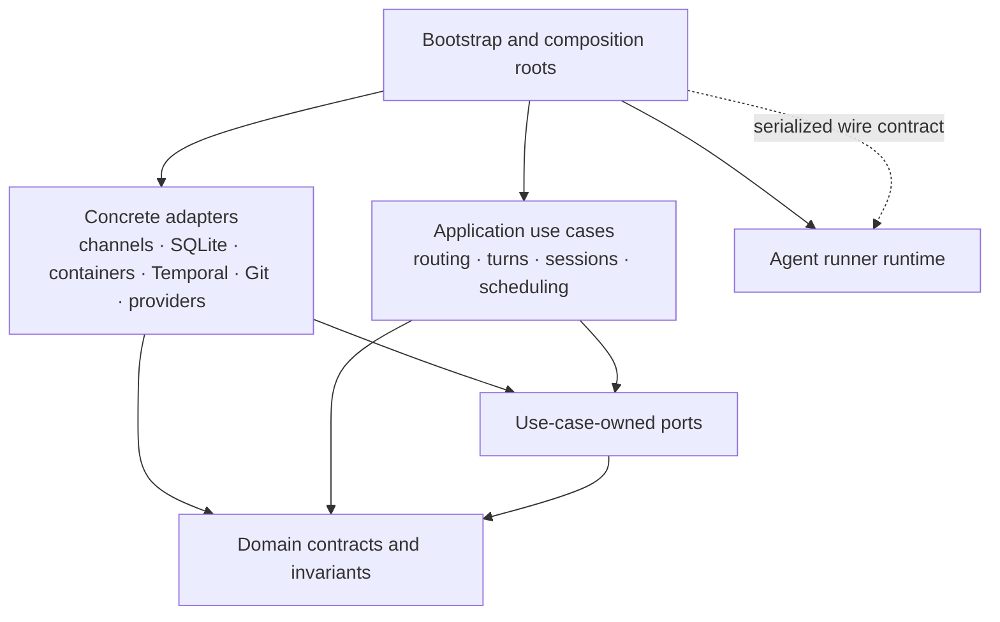

<!-- Agent instruction: Keep this document current-state-only. Delete completed or historical work; record implementation history in Git or Linear. -->

# Service Boundary Roadmap

Use this roadmap to make Pynchy's modular monolith easier to change safely.
It defines the remaining boundary work and the dependency direction that each
slice must move toward.

Keep Pynchy as a modular monolith. A service boundary means one package owns
the use case and its invariants, data crosses through a semantic type, the
consumer owns its port, a concrete adapter implements it, and a composition
root wires the implementation. Persistence operations must preserve the
transaction that gives the use case its meaning.

Do not introduce network services, a generic dependency-injection framework,
or generic CRUD repositories for this work.

## Target dependency direction

| Role | Dependency rule |
|---|---|
| Domain contracts | Depend only on the standard library and other domain contracts. |
| Application use cases | Depend on domain contracts and owned ports. |
| Ports and plugin API | Depend inward; name the capability required by one use case. |
| Concrete adapters | Implement ports; do not call concrete sibling adapters or application implementations. |
| Composition roots | May select and wire concrete implementations. |
| Agent runner | Remains a separate runtime connected through serialized input and output contracts. |

Existing directories need not move before they satisfy one of these roles.
Keep semantic SQLite transactions intact; do not split turn, cursor, and
routed-delivery finalization into generic adapter calls.

## Current enforcement

`architecture.toml`, `architecture-baseline.toml`, and the blocking
`check-architecture-boundaries` prek and CI steps enforce the target direction.
The baseline records exact existing invalid imports, so new debt fails and a
refactoring slice removes its matching entry. The policy and baseline are the
machine-checked source of truth; Graphify remains an advisory navigation tool.

The agent runner already validates typed event streams before both container
and host-direct consumers publish a terminal result. Preserve that shared
boundary when changing providers or their wire contract.

## Remaining work

### Type inbound identity and provenance

`NewMessage.metadata` still carries authority for routed messages: turn
identity, authenticated external-route status, public-source provenance,
provider identity, and conversation claims. Replace those lifecycle and
security fields with an `InboundEnvelope` and semantic identity types at the
provider boundary. Keep metadata for optional presentation details such as
attachments and reply rendering.

The messaging use cases must accept the envelope, and the envelope codec must
be the only temporary reader or writer of the migrated metadata keys. Add the
metadata-bypass check only after the typed replacement exists.

### Narrow runtime dependencies

`MessageHandlerDeps` and `SchedulerDependencies` still expose broad live
application state, and `make_scheduler_deps()` casts `PynchyApp` to the latter.
Continue replacing them with use-case-owned capabilities. A port should state
one need—such as turn execution, scheduled completion, delivery publication,
or session reset—not expose a convenient slice of the application.

Move plugin-to-state, plugin-to-Temporal, plugin-to-container, and
container-to-messaging behavior behind those capabilities. Concrete imports
belong only in named composition roots. Move pending-question ownership out of
the messaging/container-manager cycle.

### Remove ambient and concrete configuration dependencies

State initialization already receives its database path through
`StateRuntimeConfig`. Apply the same resolved-value pattern to the remaining
state and application operations that read global settings. Do not use a
settings-bypass rule until the relevant component has a practical injected
replacement.

Core configuration still imports the Linear and Matrix implementation models
to construct discriminated unions. Replace that coupling with a plugin-owned
configuration registration contract so core configuration parses core settings
and registered plugin blocks without importing concrete integrations.

### Burn down the baseline by use case

Take one package pair or use case at a time. Each slice must:

1. introduce or narrow a semantic contract;
2. preserve or add a behavior-level contract test;
3. remove the concrete dependency; and
4. delete the matching exact baseline entry.

Do not solve the baseline with a repository-wide move, a blanket
cross-package-import ban, line-level exemptions, or an auto-fix that rewrites
imports. Do not use import degree, file count, or Graphify communities as
architecture-policy input.

## Target interactive-turn flow

1. A provider adapter authenticates and parses its payload into an
   `InboundEnvelope`.
2. An application use case admits or claims the envelope and produces a typed
   turn request.
3. An execution port sends the request to the selected host or container
   adapter.
4. The shared stream validator emits valid agent events and one terminal
   result.
5. The application finalizes the turn, cursor, and optional routed-delivery
   claim through one semantic persistence operation.
6. The application emits an `OutboundIntent`; a selected channel adapter
   performs and records remote delivery.

Adapters may convert wire or SDK shapes at steps 1, 3, and 6. They must not
reconstruct application identity from metadata or call another concrete adapter
to bypass a use case.

## Graphify freshness

Run Graphify from the repository root with `src/` as its scan target. The
`scripts/graphify_graph.py` wrapper maintains the tracked raw
`graphify-out/graph.json`: `sync-staged` rebuilds it from the Git index for a
commit, and `check` independently verifies it in CI. Keep other generated
Graphify output local unless a reviewed report belongs in documentation.

Graphify helps navigate the source tree. Do not use its inferred edges, degree,
or community data as architecture-policy input.

## Completion criteria

This roadmap completes when the baseline reaches zero, package-level cycles
remain only in named composition roots, security and lifecycle identity no
longer travel through metadata strings, core configuration no longer imports
concrete plugin implementations, and concrete adapters communicate through
use-case-owned ports. The atomic turn-finalization transaction and the shared
agent-event terminal-stream contract must remain intact.
